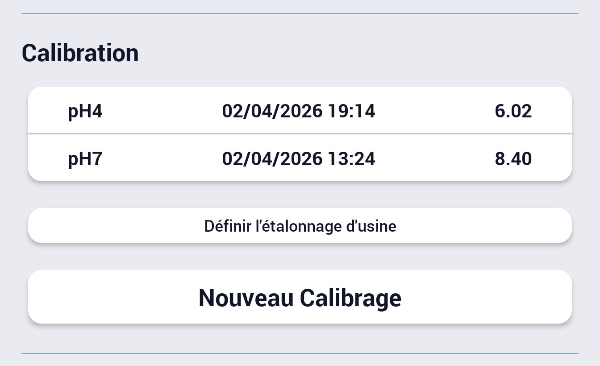
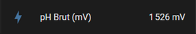
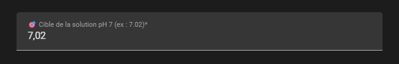
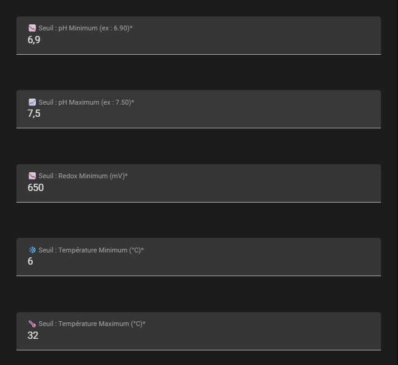

# 🎛️ Guide de Calibration - Flipr Local

Ce document explique comment configurer et affiner la calibration de votre sonde Flipr directement depuis l'interface de Home Assistant. 💡

---

## 1. ⚙️ Comprendre les options de calibration

L'intégration **Flipr Local** est conçue pour être flexible et s'adapter à votre niveau d'aisance technique. Dans la fenêtre de Configuration (icône de la roue crantée ⚙️), vous avez le choix entre deux méthodes pour renseigner les champs **Valeur pH 7** et **Valeur pH 4** :

### 📱 Méthode A : Les valeurs de l'application officielle
Si vous n'avez pas vos données brutes, ouvrez simplement l'application officielle Flipr, allez dans **Menu > Mode Expert > Vue Expert** 🔍 et relevez les valeurs de pH affichées (ex : `8.40` et `6.02`). Saisissez ces valeurs directement dans Home Assistant.

### ⚡ Méthode B : Les valeurs brutes en millivolts (Avancé)
L'intégration remonte une entité `sensor.*_ph_brut_mv` qui vous affiche la tension brute de votre sonde pH en mV 📉. Relevez la valeur une fois le Flipr plongé et stabilisé dans la solution de calibration (ex : `1600` ou `1900`), puis saisissez ces valeurs directement dans la configuration via l'icône de la roue crantée.

---

## 2. 🌡️ Ajuster la "Cible" de la solution (Température)

La chimie de l'eau est très sensible à la chaleur ☀️. Dans un bassin protégé par un abri, l'eau chauffe vite, et cette règle physique s'applique aussi à vos solutions de calibration ! 

Le pH d'une solution tampon varie légèrement en fonction de sa température au moment où vous y trempez la sonde 💧.
* 📦 Regardez au dos de votre sachet ou flacon de calibration (par exemple, pour le pH 7.00).
* 📊 Vous y verrez un tableau indiquant la valeur exacte selon la température du liquide.
* 🎯 **Exemple :** À 20°C, une solution pH 7 vaut en réalité **7.02**. 

C'est cette valeur très précise que vous devez saisir dans les champs **Cible de la solution**. ✅

---

## 3. 🚨 Configurer les seuils d'alerte

L'intégration crée automatiquement des capteurs binaires de statut (pH Statut, Chlore / Redox Statut, Température Statut). Vous pouvez définir vos propres limites dans la configuration :
* ⚖️ **pH Min / Max :** (Défaut : 6.90 - 7.50)
* 🛡️ **Redox Min :** (Défaut : 650 mV)
* ❄️ **Température Min :** Utile pour anticiper le risque de gel l'hiver (Défaut : 6.0°C)
* 🥵 **Température Max :** Pratique pour éviter que l'eau ne tourne si elle chauffe trop (Défaut : 32.0°C)

Si l'une des mesures dépasse ces seuils, le capteur passera à l'état "Problème" ⚠️, ce qui est idéal pour déclencher vos automatisations (notifications 📱, mise en route de la filtration 🔄, etc.).

